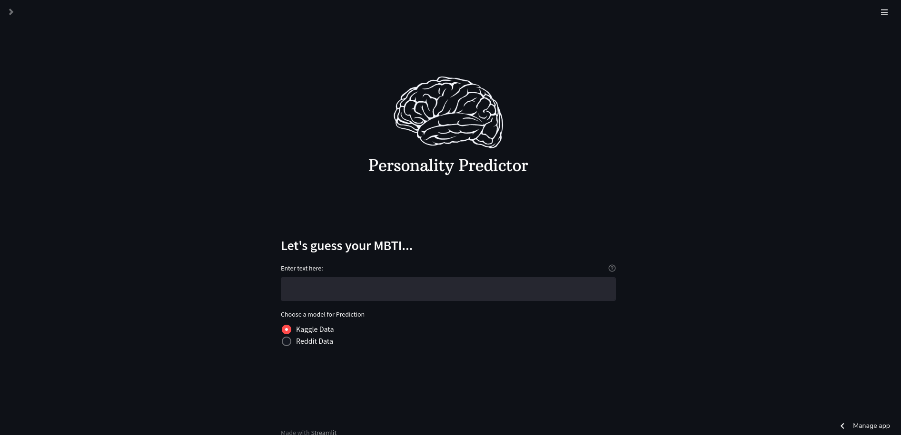
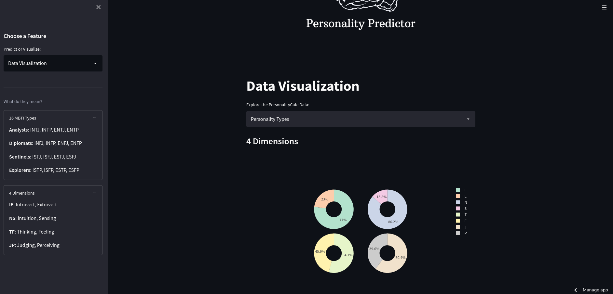

<h1 align='center'> PERSONALITY PREDICTOR </h1>
<p align='center'> A simple streamlit app to predict your MBTI personality type based on your input text. </p>


<p align='center'> 
<a></a>
<a></a>
</p>

## Demo

App **[Link](https://atmozki-personality-predictor-app-6201a8.streamlit.app/)**<br>
Model Files **[Link](https://)**<br>

## Run Locally:

1. Clone the project

```bash
  git clone https://github.com/atmozki/Personality-Predictor.git
```

2. Go to the project directory

```bash
  cd Personality-Predictor
```

3. Install dependencies

```bash
  pip install -r requirements.txt
```

4. Start the server

```bash
  streamlit run app.py
```

## Credits

Andrel's **[MBTI Prediction Tool](https://github.com/ackw/mbti-prediction-tool)**.
